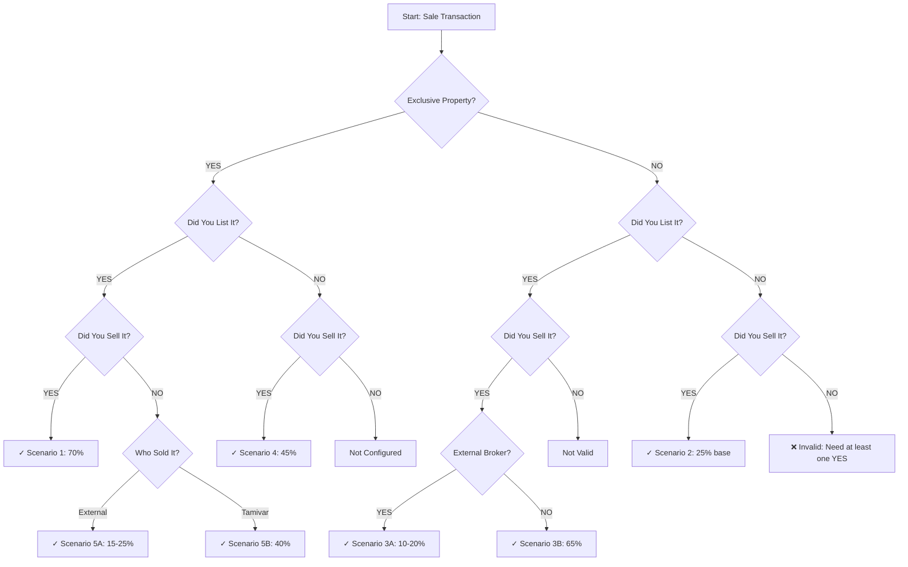

# Sale Transaction Commissions

This guide explains how to calculate your commission for sale transactions based on different property scenarios.

## Overview

Sale commissions are calculated based on three key questions:

1. **Is it an exclusive property?** (¿Es una propiedad exclusiva?)
2. **Did you list it?** (¿Tu la enlistaste?)
3. **Did you sell it?** (¿Tu la vendiste?)

Your answers determine which scenario applies and what percentage of the net commission you receive.

<Note>
  All percentages are calculated from the **net commission** after deducting 7% for taxes and administrative costs.
</Note>

## Commission Calculation Formula

<Steps>
  <Step title="Calculate Principal Commission">
    Multiply the property cost by the commission percentage:
    
    ```
    Principal Commission = Property Cost × Commission %
    ```
    
    **Example:** $2,800,000 × 5% = $140,000
  </Step>

  <Step title="Calculate Net Commission">
    Deduct 7% from the principal commission:
    
    ```
    Net Commission = Principal Commission × 0.93
    ```
    
    **Example:** $140,000 × 0.93 = $130,200
  </Step>

  <Step title="Apply Your Percentage">
    Multiply the net commission by your scenario percentage:
    
    ```
    Your Commission = Net Commission × Your %
    ```
    
    **Example (70% scenario):** $130,200 × 0.70 = $91,140
  </Step>
</Steps>

## All Sale Scenarios

### Scenario 1: Full Transaction (70%)

<Accordion title="Exclusive: YES | Listed: YES | Sold: YES">
  **Your Commission: 70% of net commission**
  
  This is the highest commission tier. You receive 70% when you:
  - Listed the property exclusively
  - Were the listing agent
  - Closed the sale yourself
  
  **Real Example:**
  - Property Cost: $2,800,000
  - Commission Rate: 5%
  - Principal Commission: $140,000
  - Net Commission (after 7% deduction): $130,200
  - **Your Payment: $91,140** (70% of $130,200)
  
  **Code Reference:** `calculations.ts:65` - `caso-70`
</Accordion>

### Scenario 2: You Sold Only (25%)

<Accordion title="Exclusive: NO | Listed: NO | Sold: YES">
  **Your Commission: 25% of net commission**
  
  You receive 25% when you:
  - Sold a non-exclusive property
  - Did not list the property
  - Closed the sale yourself
  - Worked without another advisor (solo)
  
  **Real Example:**
  - Property Cost: $2,800,000
  - Commission Rate: 5%
  - Net Commission: $130,200
  - **Your Payment: $32,550** (25% of $130,200)
  
  **Code Reference:** `calculations.ts:66,83-84`
  
  <Note>
    This scenario requires answering additional questions about team collaboration. See [Team Scenarios](/guide/team-scenarios) for details.
  </Note>
</Accordion>

### Scenario 3: Non-Exclusive But You Listed and Sold

<Accordion title="Exclusive: NO | Listed: YES | Sold: YES">
  **Your Commission: 10%, 20%, or 65%** (depends on external broker involvement)
  
  This scenario requires an additional question: **Was it with an external broker?**
  
  <Tabs>
    <Tab title="With External Broker">
      **Commission: 10% (can increase to 20%)**
      
      When an external broker brings the buyer:
      - Base commission: 10%
      - Can increase to 20% based on your process involvement
      
      **Real Example:**
      - Net Commission: $130,200
      - **Base Payment: $13,020** (10%)
      - **Potential Payment: $26,040** (20% with good follow-up)
      
      The system will show: "*Puede subir a 20% según tu seguimiento en el proceso"
      
      **Code Reference:** `calculations.ts:67,99`
    </Tab>
    
    <Tab title="Without External Broker">
      **Commission: 65%**
      
      When you brought the buyer yourself:
      - You listed the property (non-exclusive)
      - You found and closed with the buyer
      - No external broker involved
      
      **Real Example:**
      - Net Commission: $130,200
      - **Your Payment: $84,630** (65%)
      
      **Code Reference:** `calculations.ts:67,100`
    </Tab>
  </Tabs>
  
  **Code Reference:** `calculations.ts:67` - `caso-pregunta-broker-externo`
</Accordion>

### Scenario 4: Exclusive But You Didn't List It (45%)

<Accordion title="Exclusive: YES | Listed: NO | Sold: YES">
  **Your Commission: 45% of net commission**
  
  You receive 45% when you:
  - Sold an exclusive property
  - Did not list it yourself (another agent listed it)
  - Closed the sale
  
  **Real Example:**
  - Property Cost: $2,800,000
  - Commission Rate: 5%
  - Net Commission: $130,200
  - **Your Payment: $58,590** (45% of $130,200)
  
  **Code Reference:** `calculations.ts:68,101`
</Accordion>

### Scenario 5: You Listed But Didn't Sell

<Accordion title="Exclusive: YES | Listed: YES | Sold: NO">
  **Your Commission: 15%, 25%, or 40%** (depends on who sold it)
  
  This scenario requires an additional question: **Who sold the property?**
  
  <Tabs>
    <Tab title="External Broker Sold It">
      **Commission: 15% (can increase to 25%)**
      
      When an external broker closed the sale:
      - You listed the exclusive property
      - External broker brought the buyer and closed
      - Base commission: 15%
      - Can increase to 25% based on your process involvement
      
      **Real Example:**
      - Net Commission: $130,200
      - **Base Payment: $19,530** (15%)
      - **Potential Payment: $32,550** (25% with good follow-up)
      
      The system will show: "*Puede subir a 25% según tu seguimiento en el proceso"
      
      **Code Reference:** `calculations.ts:69,102`
    </Tab>
    
    <Tab title="Tamivar Agent Sold It">
      **Commission: 40%**
      
      When another Tamivar agent closed the sale:
      - You listed the exclusive property
      - Another internal agent brought the buyer and closed
      - Fixed commission: 40%
      
      **Real Example:**
      - Net Commission: $130,200
      - **Your Payment: $52,080** (40%)
      
      **Code Reference:** `calculations.ts:69,103`
    </Tab>
  </Tabs>
  
  **Code Reference:** `calculations.ts:69` - `caso-pregunta-vendio`
</Accordion>

## Decision Tree

Use this flowchart to quickly identify your scenario:



## Invalid Scenarios

<Warning>
  If you answer **NO** to all three questions (Exclusive, Listed, Sold), the system cannot calculate a commission. You must have participated in at least one aspect of the transaction.
  
  The app will display: "Para que este sistema te pueda arrojar un dato concreto, debes colocar por lo menos un 'SI' en alguna de las opciones"
</Warning>

## Complete Example Calculation

Let's walk through a complete scenario:

<Steps>
  <Step title="Enter Transaction Details">
    - Property Cost: **$3,500,000 MXN**
    - Commission Rate: **5%**
  </Step>

  <Step title="Answer Scenario Questions">
    - Exclusive property? **YES**
    - Did you list it? **YES**
    - Did you sell it? **NO**
    - Who sold it? **External Broker**
  </Step>

  <Step title="System Identifies Scenario">
    This matches **Scenario 5A**: You listed but external broker sold
    - Base percentage: **15%**
    - Potential percentage: **25%**
  </Step>

  <Step title="Calculate Commission">
    1. Principal Commission: $3,500,000 × 0.05 = **$175,000**
    2. Net Commission: $175,000 × 0.93 = **$162,750**
    3. Your Base Commission: $162,750 × 0.15 = **$24,412.50**
    4. Your Potential Commission: $162,750 × 0.25 = **$40,687.50**
  </Step>

  <Step title="Review Result">
    The system displays:
    - **Your payment: $24,412.50 MXN**
    - *Can increase to $40,687.50 based on your process involvement
    - Option to download ticket with full breakdown
  </Step>
</Steps>

## Next Steps

<CardGroup cols={2}>
  <Card title="Team Scenarios" icon="users" href="/guide/team-scenarios">
    Learn about team sales and collaboration percentages
  </Card>
  
  <Card title="Understanding Percentages" icon="percent" href="/guide/understanding-percentages">
    Deep dive into how percentages are determined
  </Card>
  
  <Card title="Rental Transactions" icon="house" href="/guide/rental-transactions">
    Calculate rental property commissions
  </Card>
  
  <Card title="API Reference" icon="code" href="/api/calculations">
    Technical documentation of calculation functions
  </Card>
</CardGroup>