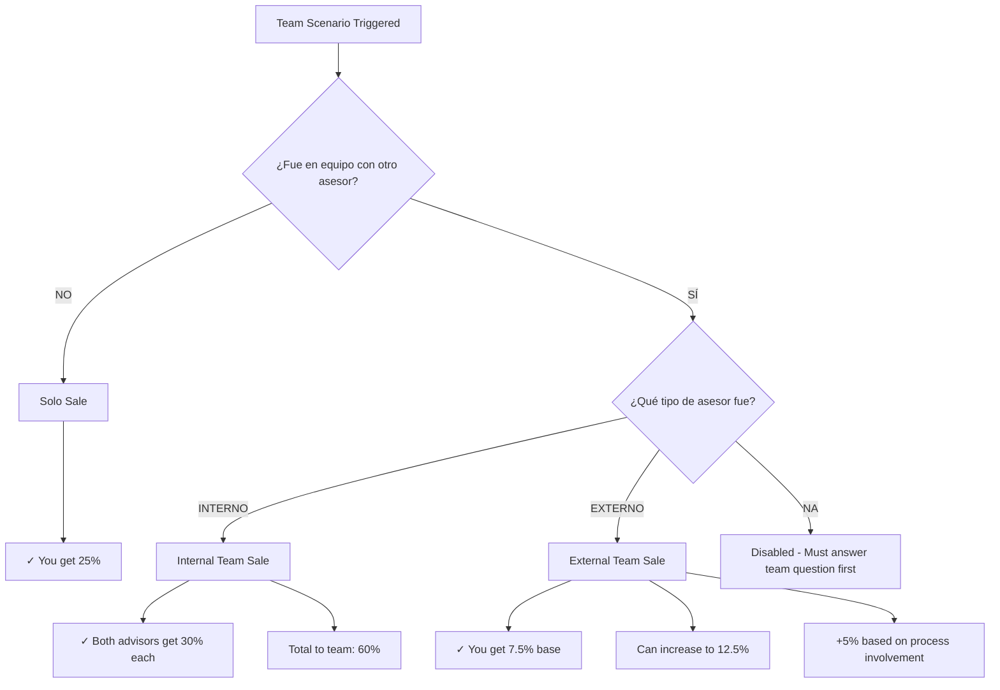

# Team Sales and Collaboration Scenarios

This guide covers how commissions are calculated when working with other advisors, including internal team members and external brokers.

## When Team Scenarios Apply

Team scenarios are triggered when you answer the three main questions as:
- **Exclusive:** NO
- **Listed:** NO  
- **Sold:** YES

This means you sold a property you didn't list, which often involves collaboration.

**Code Reference:** `calculations.ts:66` - Returns `"caso-equipo-tipo-asesor"`

## The Two Team Questions

When in a team scenario, the system asks:

<Steps>
  <Step title="Did you work with another advisor?">
    **Question:** "¿Fue en equipo con otro asesor?"
    
    Options:
    - **Sí** (Yes) - Leads to team percentage split
    - **No** - You get solo sale percentage (25%)
    
    **Code Reference:** `page.tsx:316-337`
  </Step>

  <Step title="What type of advisor?">
    **Question:** "¿Qué tipo de asesor fue?"
    
    This only appears if you answered "Sí" to the previous question.
    
    Options:
    - **Interno** - Another Tamivar advisor (30% each)
    - **Externo** - External broker (7.5% for you)
    - **NA** - Not applicable (disabled if you said "No" to team)
    
    **Code Reference:** `page.tsx:340-370`
  </Step>
</Steps>

## Team Scenario Breakdown

### Solo Sale (No Team) - 25%

<Accordion title="You sold alone, no collaboration">
  **Percentage: 25%**
  
  **When this applies:**
  - Property was NOT exclusive
  - You did NOT list it
  - You DID sell it
  - You worked ALONE (no team)
  
  **Answers:**
  - ¿Fue en equipo con otro asesor? **NO**
  - ¿Qué tipo de asesor fue? **NA**
  
  **Code Logic:**
  ```typescript
  if (casoPrincipal === "caso-equipo-tipo-asesor" && 
      fueEnEquipoConOtroAsesor === "no" && 
      tipoAsesorEquipo === "na")
    return 25
  ```
  
  **Real Example:**
  - Property Cost: $2,500,000
  - Commission Rate: 5%
  - Principal Commission: $125,000
  - Net Commission: $116,250 (after 7% deduction)
  - **Your Payment: $29,062.50** (25% of $116,250)
  
  **Code Reference:** `calculations.ts:83-84`
</Accordion>

### Internal Team Sale - 30% Each

<Accordion title="You worked with another Tamivar advisor">
  **Percentage: 30% for EACH advisor**
  
  **When this applies:**
  - Property was NOT exclusive
  - You did NOT list it
  - You DID sell it
  - You worked with ANOTHER INTERNAL TAMIVAR ADVISOR
  
  **Answers:**
  - ¿Fue en equipo con otro asesor? **SÍ**
  - ¿Qué tipo de asesor fue? **INTERNO**
  
  **Code Logic:**
  ```typescript
  if (casoPrincipal === "caso-equipo-tipo-asesor" &&
      fueEnEquipoConOtroAsesor === "si" &&
      tipoAsesorEquipo === "interno") {
    return 30
  }
  ```
  
  **Real Example:**
  - Property Cost: $3,000,000
  - Commission Rate: 5%
  - Principal Commission: $150,000
  - Net Commission: $139,500 (after 7% deduction)
  - **Advisor 1 Payment: $41,850** (30%)
  - **Advisor 2 Payment: $41,850** (30%)
  - **Total to team: $83,700** (60% of net)
  
  **Special Display:**
  The app shows a unique message for this scenario:
  ```
  A los dos asesores les corresponde el 30% de la comision principal 
  que equivale a: $41,850.00 MXN
  ```
  
  **Code References:**
  - Calculation: `calculations.ts:86-91`
  - Display: `page.tsx:403-408`
  - Ticket: `calculations.ts:201-209`
</Accordion>

### External Team Sale - 7.5% (Can Increase to 12.5%)

<Accordion title="You worked with an external broker">
  **Percentage: 7.5% (base), up to 12.5% (potential)**
  
  **When this applies:**
  - Property was NOT exclusive
  - You did NOT list it
  - You DID sell it
  - You worked with AN EXTERNAL BROKER
  - External broker has the client
  - Tamivar has the property
  
  **Answers:**
  - ¿Fue en equipo con otro asesor? **SÍ**
  - ¿Qué tipo de asesor fue? **EXTERNO**
  
  **Code Logic:**
  ```typescript
  if (casoPrincipal === "caso-equipo-tipo-asesor" &&
      fueEnEquipoConOtroAsesor === "si" &&
      tipoAsesorEquipo === "externo") {
    return 7.5
  }
  ```
  
  **Real Example:**
  - Property Cost: $4,000,000
  - Commission Rate: 5%
  - Principal Commission: $200,000
  - Net Commission: $186,000 (after 7% deduction)
  - **Your Base Payment: $13,950** (7.5%)
  - **Your Potential Payment: $23,250** (12.5% with involvement)
  - **Potential Increase: +$9,300**
  
  **Special Display:**
  The app shows:
  ```
  Broker externo tiene el cliente.
  Tamivar tiene la propiedad.
  A ti te corresponde el 7.5%.
  
  $13,950.00 MXN
  
  *Puede subir un 5% más según tu seguimiento en el proceso, 
   que equivaldría a $23,250.00
  ```
  
  **Code References:**
  - Calculation: `calculations.ts:93-98`
  - Display: `page.tsx:409-447`
  - Ticket: `calculations.ts:210-222`, `234-240`
</Accordion>

## Team Scenario Decision Tree



## Detailed Comparison

<Tabs>
  <Tab title="Solo Sale (25%)">
    ### Solo Sale Details
    
    **Characteristics:**
    - You work independently
    - No team member involvement
    - All client interaction is yours
    - Full responsibility for the sale
    
    **Advantages:**
    - Higher percentage than external team (25% vs 7.5%)
    - No need to coordinate with others
    - Faster decision making
    - Keep full commission to yourself
    
    **Disadvantages:**
    - Lower than internal team collaboration (25% vs 30%)
    - All work falls on you
    - No shared expertise
    - Limited to your own network
    
    **Best for:**
    - Experienced advisors
    - Clear client relationships
    - Direct property access
    - Independent work style
  </Tab>
  
  <Tab title="Internal Team (30% each)">
    ### Internal Team Details
    
    **Characteristics:**
    - Work with another Tamivar advisor
    - Both receive 30% (60% total to team)
    - Shared responsibilities
    - Collaborative approach
    
    **Advantages:**
    - Highest team percentage (30% each)
    - Shared workload and expertise
    - Combined networks
    - Mutual support and coverage
    - Better client service potential
    
    **Disadvantages:**
    - Must split commission (though each gets more than solo)
    - Requires coordination
    - Shared decision-making
    - Need compatible work styles
    
    **Best for:**
    - Complex transactions
    - Complementary skill sets
    - Larger properties requiring more attention
    - Building team expertise
    
    **Special Note:**
    This is the ONLY scenario where the display message mentions "both advisors":
    ```
    A los dos asesores les corresponde el 30%
    ```
  </Tab>
  
  <Tab title="External Team (7.5%)">
    ### External Team Details
    
    **Characteristics:**
    - External broker has the client
    - Tamivar (you) has the property
    - You facilitate property access
    - Limited transaction control
    
    **Advantages:**
    - Access to external broker's clients
    - Expanded market reach
    - Can increase to 12.5% with involvement
    - Still get paid for property access
    
    **Disadvantages:**
    - Lowest base percentage (7.5%)
    - Limited control over process
    - External party manages client
    - Requires strong coordination
    
    **Best for:**
    - Properties hard to sell internally
    - Accessing new buyer markets
    - Building external broker relationships
    - Quick property turnover
    
    **Increase Opportunity:**
    Active involvement in the process can increase your commission by 5 percentage points (7.5% → 12.5%):
    - Participate in showings
    - Support negotiations
    - Assist with documentation
    - Follow up throughout process
  </Tab>
</Tabs>

## Team Percentage Examples

### Example 1: Internal Team Success

<Steps>
  <Step title="Scenario Setup">
    Two Tamivar advisors team up to sell a non-exclusive property:
    
    - Property Cost: $5,000,000
    - Commission Rate: 5%
    - Exclusive: NO
    - Listed: NO
    - Sold: YES
    - Team: YES (internal)
  </Step>

  <Step title="Calculate Base Amounts">
    - Principal Commission: $5,000,000 × 0.05 = $250,000
    - Net Commission: $250,000 × 0.93 = $232,500
  </Step>

  <Step title="Apply Team Percentage">
    Each advisor gets 30%:
    
    - Advisor A: $232,500 × 0.30 = **$69,750**
    - Advisor B: $232,500 × 0.30 = **$69,750**
    - Total to team: **$139,500** (60% of net)
  </Step>

  <Step title="Compare to Solo">
    If one advisor had worked alone:
    
    - Solo commission: $232,500 × 0.25 = **$58,125**
    
    **Each team member earns $11,625 MORE than solo** (30% vs 25%)
    
    This rewards collaboration and shared expertise.
  </Step>
</Steps>

### Example 2: External Broker Collaboration

<Steps>
  <Step title="Scenario Setup">
    You facilitate property access for external broker's client:
    
    - Property Cost: $3,200,000
    - Commission Rate: 5%
    - Exclusive: NO
    - Listed: NO
    - Sold: YES
    - Team: YES (external)
  </Step>

  <Step title="Calculate Base Amounts">
    - Principal Commission: $3,200,000 × 0.05 = $160,000
    - Net Commission: $160,000 × 0.93 = $148,800
  </Step>

  <Step title="Apply Base Percentage">
    Base commission at 7.5%:
    
    - Your Base: $148,800 × 0.075 = **$11,160**
  </Step>

  <Step title="Calculate Potential Increase">
    If you're actively involved, can increase to 12.5%:
    
    - Your Potential: $148,800 × 0.125 = **$18,600**
    - **Increase: +$7,440** (5 percentage points)
    
    This 67% increase rewards your process involvement!
  </Step>
</Steps>

### Example 3: Solo vs Team Comparison

<Accordion title="Same Property, Different Approaches">
  **Property Details:**
  - Cost: $2,000,000
  - Commission: 5%
  - Principal: $100,000
  - Net: $93,000
  
  **Scenario A: Solo Sale (25%)**
  - Your commission: $93,000 × 0.25 = **$23,250**
  - You do all the work
  - Keep entire commission
  
  **Scenario B: Internal Team (30% each)**
  - Your commission: $93,000 × 0.30 = **$27,900**
  - Partner's commission: $27,900
  - Shared workload
  - **You earn $4,650 MORE than solo**
  
  **Scenario C: External Team (7.5-12.5%)**
  - Base commission: $93,000 × 0.075 = **$6,975**
  - Potential commission: $93,000 × 0.125 = **$11,625**
  - Lowest effort, lowest reward
  - Access to external broker's client base
  
  **Analysis:**
  Internal team collaboration is rewarded with the highest individual percentage, incentivizing teamwork within Tamivar.
</Accordion>

## Commission Split Philosophy

### Why Internal Teams Get More

<Note>
  Internal team members each receive **30%** (60% total) while solo sales get **25%**. This 5-point premium rewards:
  
  - Knowledge sharing
  - Combined expertise
  - Better client service
  - Team culture building
  - Shared responsibility
</Note>

### Why External Teams Get Less

External broker scenarios (7.5% base) reflect:

- Limited transaction control
- External party manages client relationship
- You provide property access only
- Lower value-add compared to full transaction management

**However**, active involvement can increase your commission by 67% (7.5% → 12.5%)!

## Common Team Scenarios

<AccordionGroup>
  <Accordion title="Can three advisors split a commission?">
    The current system supports two-party splits (you + one other advisor). For three-way splits or more complex arrangements, consult with management for custom commission structures outside the Tabulador system.
  </Accordion>
  
  <Accordion title="What if my partner is new vs experienced?">
    The Tabulador system doesn't differentiate based on experience level. Both internal team members receive the same 30% regardless of seniority, skill level, or contribution amount. This promotes equal collaboration.
  </Accordion>
  
  <Accordion title="How do I prove process involvement for percentage increases?">
    Document your involvement through:
    - Email communications
    - Showing attendance logs
    - Meeting notes
    - Negotiation participation records
    - Client interaction documentation
    
    Present this evidence when claiming the higher percentage (20%, 25%, or 12.5%).
  </Accordion>
  
  <Accordion title="Can I work with multiple external brokers?">
    Yes, but each transaction is calculated independently. If you work with External Broker A on Property 1 and External Broker B on Property 2, each gets its own commission calculation at the base 7.5% (potential 12.5%).
  </Accordion>
  
  <Accordion title="What if we disagree on the team type selection?">
    The team type (interno/externo) should be determined before closing based on:
    - Employment status (Tamivar employee = interno)
    - Broker affiliation (external company = externo)
    - Contract terms
    
    This is not negotiable per transaction - it's based on objective criteria.
  </Accordion>
</AccordionGroup>

## Team Scenario Code Flow

### How the UI Handles Team Questions

The interface shows team questions only when appropriate:

```typescript
// From page.tsx:313-372
{casoPrincipal === "caso-equipo-tipo-asesor" && (
  <div className="space-y-4">
    {/* Question 4: Team collaboration */}
    <div>
      <h2>4) Fue en equipo con otro asesor?</h2>
      <button onClick={() => setFueEnEquipoConOtroAsesor("si")}>Si</button>
      <button onClick={() => {
        setFueEnEquipoConOtroAsesor("no")
        setTipoAsesorEquipo("na") // Auto-set to NA
      }}>No</button>
    </div>

    {/* Question 5: Advisor type (only if team = yes) */}
    <div>
      <h2>5) Que tipo de asesor fue</h2>
      <button 
        onClick={() => setTipoAsesorEquipo("interno")}
        disabled={fueEnEquipoConOtroAsesor === "no"}>
        Interno
      </button>
      <button 
        onClick={() => setTipoAsesorEquipo("externo")}
        disabled={fueEnEquipoConOtroAsesor === "no"}>
        Externo
      </button>
      <button onClick={() => setTipoAsesorEquipo("na")}>
        NA
      </button>
    </div>
  </div>
)}
```

**Key Logic:**
- If you select "No" for team, advisor type automatically becomes "NA"
- Interno and Externo buttons are disabled when team = "No"
- NA is always available

## Next Steps

<CardGroup cols={2}>
  <Card title="Sale Transactions" icon="house-circle-check" href="/guide/sale-transactions">
    Complete guide to all sale scenarios and percentages
  </Card>
  
  <Card title="Understanding Percentages" icon="percent" href="/guide/understanding-percentages">
    Deep dive into commission percentage logic
  </Card>
  
  <Card title="Rental Transactions" icon="house" href="/guide/rental-transactions">
    Learn about rental commission calculations
  </Card>
  
  <Card title="API Reference" icon="code" href="/api/calculations">
    Technical documentation for developers
  </Card>
</CardGroup>