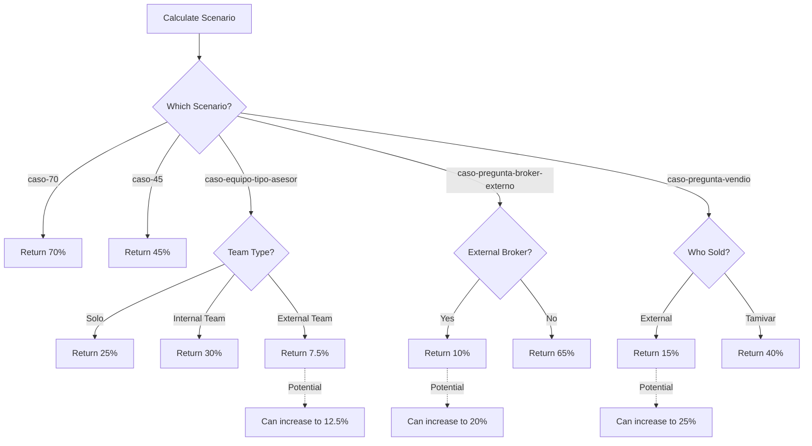

# Understanding Commission Percentages

This guide explains the logic behind commission percentages in the Tabulador system, including base rates, potential increases, and the factors that influence your earnings.

## The Percentage System Overview

Commission percentages in the Tabulador system range from **7.5% to 70%** of the net commission, depending on your level of involvement in the transaction.

<Note>
  All percentages apply to the **net commission** after the 7% deduction for taxes and administrative costs, not the gross amount.
</Note>

## Percentage Hierarchy

### Highest to Lowest Commission Rates

| Percentage | Scenario | Your Involvement | Code Reference |
|------------|----------|------------------|----------------|
| **70%** | Full exclusive transaction | Listed + Sold exclusive property | `calculations.ts:82` |
| **65%** | Non-exclusive, you did both | Listed + Sold non-exclusive (no external broker) | `calculations.ts:100` |
| **45%** | Exclusive but didn't list | Sold exclusive property (didn't list) | `calculations.ts:101` |
| **40%** | Listed but didn't sell | Listed exclusive, Tamivar agent sold | `calculations.ts:103` |
| **30%** | Team sale (internal) | Sold with another internal advisor | `calculations.ts:90` |
| **25%** | Basic sale OR potential | Sold only (no listing) OR external broker listing increase | `calculations.ts:84,102,227` |
| **20%** | Potential increase | Non-exclusive listing with external broker (increased) | `calculations.ts:99,231` |
| **15%** | External broker sale | Listed exclusive, external broker sold | `calculations.ts:102,227` |
| **10%** | External broker listing | Listed non-exclusive, external broker sold | `calculations.ts:99,231` |
| **7.5%** | Team with external | Sold with external advisor | `calculations.ts:97` |

## How Percentages Are Calculated

### The `getPorcentajeFinal()` Function

The system uses the `getPorcentajeFinal()` function to determine your commission percentage based on scenario and additional factors.

**Code Reference:** `calculations.ts:73-105`

```typescript
export function getPorcentajeFinal(params: {
  casoPrincipal: CasoPrincipal | null
  fueConBrokerExterno: FueConBrokerExterno | null
  fueEnEquipoConOtroAsesor: OpcionSiNo | null
  quienVendio: QuienVendio | null
  tipoAsesorEquipo: TipoAsesorEquipo
}) {
  const { casoPrincipal, fueConBrokerExterno, fueEnEquipoConOtroAsesor, 
          quienVendio, tipoAsesorEquipo } = params

  // Highest commission: Full exclusive transaction
  if (casoPrincipal === "caso-70") return 70
  
  // Team scenarios
  if (casoPrincipal === "caso-equipo-tipo-asesor" && 
      fueEnEquipoConOtroAsesor === "no" && 
      tipoAsesorEquipo === "na")
    return 25
  
  if (casoPrincipal === "caso-equipo-tipo-asesor" &&
      fueEnEquipoConOtroAsesor === "si" &&
      tipoAsesorEquipo === "interno") {
    return 30
  }
  
  if (casoPrincipal === "caso-equipo-tipo-asesor" &&
      fueEnEquipoConOtroAsesor === "si" &&
      tipoAsesorEquipo === "externo") {
    return 7.5
  }
  
  // External broker scenarios
  if (casoPrincipal === "caso-pregunta-broker-externo" && 
      fueConBrokerExterno === "si") return 10
  if (casoPrincipal === "caso-pregunta-broker-externo" && 
      fueConBrokerExterno === "no") return 65
  
  // Exclusive but didn't list
  if (casoPrincipal === "caso-45") return 45
  
  // Listed but didn't sell
  if (casoPrincipal === "caso-pregunta-vendio" && 
      quienVendio === "broker-externo") return 15
  if (casoPrincipal === "caso-pregunta-vendio" && 
      quienVendio === "tamivar") return 40
  
  return null
}
```

## Percentage Increases (Potential Bonuses)

Some scenarios allow your commission to increase based on your involvement in the sales process.

### Scenario 1: External Broker Sold Your Exclusive Listing

<Accordion title="15% → 25% Increase">
  **Base Rate:** 15%  
  **Potential Rate:** 25%  
  **Increase:** +10 percentage points
  
  **When This Applies:**
  - You listed an exclusive property
  - An external broker brought the buyer and closed
  - Your involvement in the process can increase your share
  
  **Real Example:**
  - Net Commission: $130,200
  - Base Payment (15%): $19,530
  - Potential Payment (25%): $32,550
  - **Increase: +$13,020**
  
  **Displayed Message:**
  ```
  *Puede subir a 25% según tu seguimiento en el proceso, 
   que equivaldría a $32,550.00
  ```
  
  **Code References:**
  - Base: `calculations.ts:102`
  - Potential: `calculations.ts:227`, `page.tsx:427-430`
  - Calculation: `calculations.ts:54` (montoPotencial25)
</Accordion>

### Scenario 2: Non-Exclusive Listing with External Broker

<Accordion title="10% → 20% Increase">
  **Base Rate:** 10%  
  **Potential Rate:** 20%  
  **Increase:** +10 percentage points
  
  **When This Applies:**
  - You listed a non-exclusive property
  - You sold it yourself
  - An external broker was involved
  
  **Real Example:**
  - Net Commission: $130,200
  - Base Payment (10%): $13,020
  - Potential Payment (20%): $26,040
  - **Increase: +$13,020**
  
  **Displayed Message:**
  ```
  *Puede subir a 20% según tu seguimiento en el proceso, 
   que equivaldría a $26,040.00
  ```
  
  **Code References:**
  - Base: `calculations.ts:99`
  - Potential: `calculations.ts:231`, `page.tsx:433-437`
  - Calculation: `calculations.ts:55` (montoPotencial20)
</Accordion>

### Scenario 3: Team Sale with External Advisor

<Accordion title="7.5% → 12.5% Increase">
  **Base Rate:** 7.5%  
  **Potential Rate:** 12.5%  
  **Increase:** +5 percentage points
  
  **When This Applies:**
  - Non-exclusive property (you didn't list it)
  - You sold it
  - You worked with an external advisor
  - External broker has the client, Tamivar has the property
  
  **Real Example:**
  - Net Commission: $130,200
  - Base Payment (7.5%): $9,765
  - Potential Payment (12.5%): $16,275
  - **Increase: +$6,510**
  
  **Special Note:**
  This scenario has a unique description:
  ```
  Broker externo tiene el cliente.
  Tamivar tiene la propiedad.
  A ti te corresponde el 7.5%.
  ```
  
  **Displayed Message:**
  ```
  *Puede subir un 5% más según tu seguimiento en el proceso, 
   que equivaldría a $16,275.00
  ```
  
  **Code References:**
  - Base: `calculations.ts:97`
  - Potential: `calculations.ts:239`, `page.tsx:440-447`
  - Calculation: `calculations.ts:56` (montoPotencial5)
</Accordion>

## Team Collaboration Percentages

Team scenarios have specific percentage allocations:

### Internal Team (Both Advisors Get 30%)

<Note>
  When working with another internal Tamivar advisor, **both** advisors receive 30% of the net commission each.
</Note>

```typescript
// Scenario: caso-equipo-tipo-asesor
// fueEnEquipoConOtroAsesor: "si"
// tipoAsesorEquipo: "interno"

return 30 // Each advisor gets 30%
```

**Example:**
- Net Commission: $130,200
- Advisor 1 Payment: $39,060 (30%)
- Advisor 2 Payment: $39,060 (30%)
- **Total to advisors: $78,120 (60%)**

**Code Reference:** `calculations.ts:86-91`

**Display Message:**
```
A los dos asesores les corresponde el 30% de la comision principal 
que equivale a: $39,060.00 MXN
```

**Code Reference:** `page.tsx:403-408`, `calculations.ts:205-209`

### External Team (You Get 7.5%)

When working with an external advisor:

```typescript
// Scenario: caso-equipo-tipo-asesor
// fueEnEquipoConOtroAsesor: "si"
// tipoAsesorEquipo: "externo"

return 7.5
```

**Example:**
- Net Commission: $130,200
- Your Payment: $9,765 (7.5%)
- Can increase to: $16,275 (12.5%)

**Code Reference:** `calculations.ts:93-98`

### Solo Sale (25%)

When you sell alone without listing:

```typescript
// Scenario: caso-equipo-tipo-asesor
// fueEnEquipoConOtroAsesor: "no"
// tipoAsesorEquipo: "na"

return 25
```

**Code Reference:** `calculations.ts:83-84`

## Why Different Percentages?

The percentage system reflects the value of different contributions:

<Tabs>
  <Tab title="High Percentage (65-70%)">
    **What You Did:**
    - Listed the property (marketing, photos, description)
    - Managed client relationship from start to finish
    - Closed the sale
    - Handled all negotiations
    
    **Value Provided:**
    - Complete transaction management
    - Full client experience
    - Maximum company benefit
    
    **Result:** Highest compensation
  </Tab>
  
  <Tab title="Medium Percentage (40-45%)">
    **What You Did:**
    - Either listed OR sold (not both)
    - Significant involvement but not complete
    - Shared responsibilities with others
    
    **Value Provided:**
    - Major contribution to the sale
    - Professional service in your area
    - Partial transaction management
    
    **Result:** Good compensation for partial work
  </Tab>
  
  <Tab title="Lower Percentage (7.5-25%)">
    **What You Did:**
    - Minimal listing involvement
    - Worked with external parties
    - Team collaboration with split responsibilities
    
    **Value Provided:**
    - Facilitation and coordination
    - Networking and connections
    - Support role in transaction
    
    **Result:** Fair compensation for support role
  </Tab>
</Tabs>

## Percentage Calculation Examples

### Example 1: Maximum Commission (70%)

<Steps>
  <Step title="Transaction Details">
    - Property Cost: $5,000,000
    - Commission Rate: 5%
    - Scenario: Exclusive, Listed, Sold (all YES)
  </Step>

  <Step title="Calculate Base Amounts">
    - Principal Commission: $5,000,000 × 0.05 = $250,000
    - Net Commission: $250,000 × 0.93 = $232,500
  </Step>

  <Step title="Apply 70% Rate">
    - Your Commission: $232,500 × 0.70 = **$162,750**
  </Step>
</Steps>

### Example 2: Team Internal (30% Each)

<Steps>
  <Step title="Transaction Details">
    - Property Cost: $3,000,000
    - Commission Rate: 5%
    - Scenario: Non-exclusive, Didn't list, Sold, Team with internal advisor
  </Step>

  <Step title="Calculate Base Amounts">
    - Principal Commission: $3,000,000 × 0.05 = $150,000
    - Net Commission: $150,000 × 0.93 = $139,500
  </Step>

  <Step title="Apply 30% Rate">
    - Advisor 1 Commission: $139,500 × 0.30 = **$41,850**
    - Advisor 2 Commission: $139,500 × 0.30 = **$41,850**
    - Total: $83,700 (60% of net)
  </Step>
</Steps>

### Example 3: External Broker with Increase (15% → 25%)

<Steps>
  <Step title="Transaction Details">
    - Property Cost: $4,000,000
    - Commission Rate: 5%
    - Scenario: Listed exclusive, External broker sold
  </Step>

  <Step title="Calculate Base Amounts">
    - Principal Commission: $4,000,000 × 0.05 = $200,000
    - Net Commission: $200,000 × 0.93 = $186,000
  </Step>

  <Step title="Apply Base and Potential Rates">
    - Base Commission (15%): $186,000 × 0.15 = **$27,900**
    - Potential Commission (25%): $186,000 × 0.25 = **$46,500**
    - **Potential Increase: +$18,600**
  </Step>
</Steps>

## Percentage Decision Logic

Here's how the system decides your percentage:



## Common Percentage Questions

<AccordionGroup>
  <Accordion title="Why is 70% the maximum?">
    70% represents complete ownership of the transaction - you listed an exclusive property and closed the sale yourself. The remaining 30% covers company overhead, support staff, marketing infrastructure, and other business costs.
  </Accordion>
  
  <Accordion title="Can I negotiate these percentages?">
    The percentages are fixed in the Tabulador system based on objective criteria (exclusive, listed, sold, team type). They are not negotiable as they're designed to ensure fair and consistent compensation across all advisors.
  </Accordion>
  
  <Accordion title="How do I qualify for percentage increases?">
    Increases (15%→25%, 10%→20%, 7.5%→12.5%) are based on your involvement in the sales process when an external broker is involved. Active participation in showings, negotiations, and closing activities can qualify you for the higher rate.
  </Accordion>
  
  <Accordion title="Why is the external team percentage (7.5%) so low?">
    When working with an external advisor where the external broker has the client and Tamivar has the property, you're primarily facilitating access to the property rather than managing the entire transaction. The low percentage reflects this limited scope, though it can increase to 12.5% based on your involvement.
  </Accordion>
  
  <Accordion title="What happens to the remaining percentage?">
    After your commission is paid, the remaining percentage goes to:
    - Other involved parties (team members, external brokers)
    - Company overhead and operations
    - Marketing and advertising costs
    - Office and support staff
    - Technology and infrastructure
  </Accordion>
</AccordionGroup>

## Next Steps

<CardGroup cols={2}>
  <Card title="Sale Transactions" icon="house-circle-check" href="/guide/sale-transactions">
    See how these percentages apply to real sale scenarios
  </Card>
  
  <Card title="Team Scenarios" icon="users" href="/guide/team-scenarios">
    Learn about team collaboration and percentage splits
  </Card>
  
  <Card title="Rental Transactions" icon="house" href="/guide/rental-transactions">
    Understand the simple 45% rental commission
  </Card>
  
  <Card title="API Reference" icon="code" href="/api/calculations">
    Technical documentation of percentage calculations
  </Card>
</CardGroup>